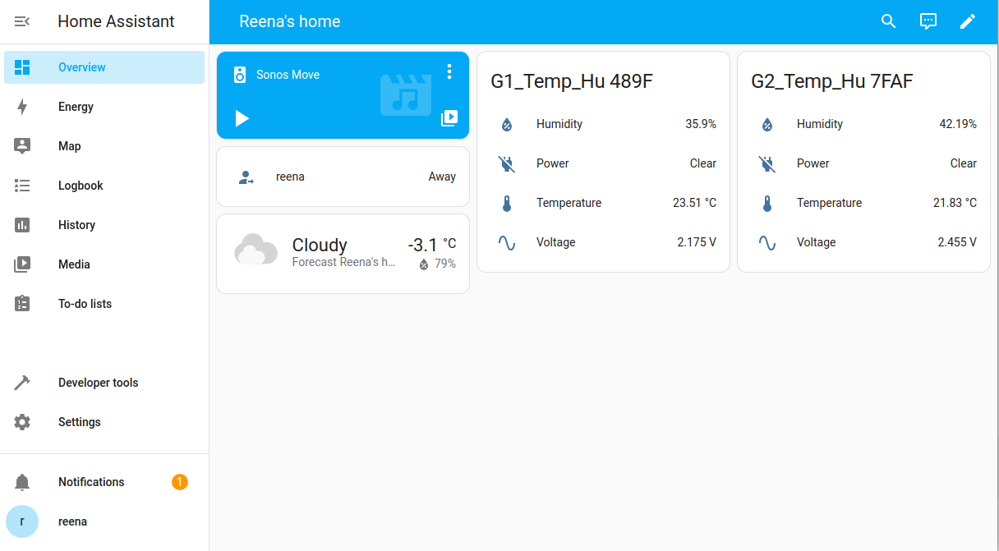

## Home Assistant (Raspberry Pi 5)

Source docs: https://www.home-assistant.io/installation/raspberrypi/ (start here)

This guide walks through installing Home Assistant on a Raspberry Pi 5 and onboarding a Shelly BLU T&H sensor. It's written for someone with no coding experience. Robby will provide remote guidance for more complex steps. 🔧

Order of steps (follow in numeric order):

1. `install.md` (flash Home Assistant OS using Raspberry Pi Imager)
2. `shelly_onboarding.md` (onboard Shelly BLU T&H)
3. `automation_android.md` (create a simple automation from Android)
4. `citizen_science.md` (forward sensor data to citizen science projects)

### Hints for Long-Term-Usage

1) **SD card endurance** - Home Assistant writes frequently. Use a high-endurance SD card or external SSD.
2) **Power supply** - Use a stable, sufficient power supply (official 5V 5A recommended for Pi 5).
3) **Backups (snapshots)** - Use Home Assistant snapshots and store them off-device (Google Drive / USB). Robby can help automate off-site backups. 🔧
4) **Network** - Wired Ethernet is more reliable than Wi‑Fi for discovery and integrations.
5) **Bluetooth & BLE** - Keep BLE sensors close for onboarding. If Bluetooth isn't detected, reboot and check System → Hardware.
6) **Time and location** - Set the correct time zone and location during onboarding (used for automations and solar events).
7) **Add-ons vs integrations** - Home Assistant OS supports Supervisor add-ons (File Editor, SSH). Use add-ons rather than manual installs if unsure.
8) **When to call Robby** - If logs show repeated errors, device discovery fails, or advanced integrations are needed, contact Robby for a remote session. 🔧