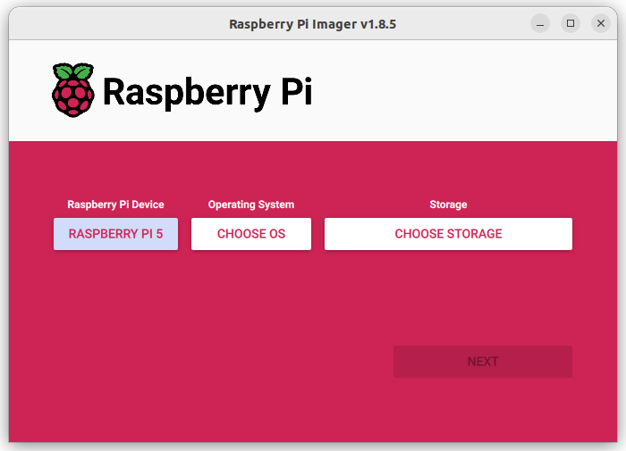
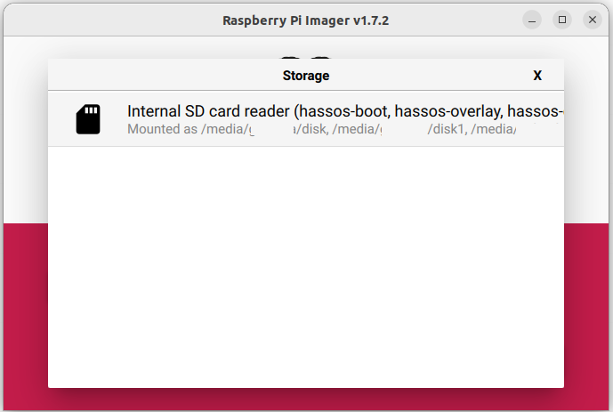
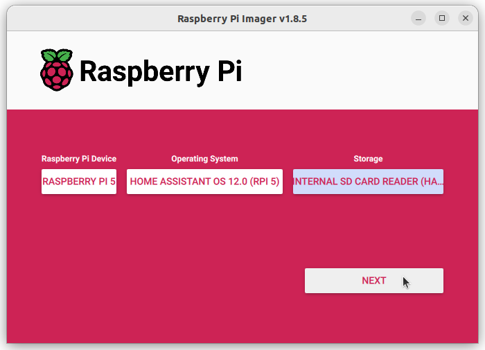

##''Install Home Assistant OS

Source docs: https://www.home-assistant.io/installation/raspberrypi/

Use Raspberry Pi Imager for consistency. The screenshots below are taken from the Home Assistant docs and show the Imager workflow.

1) Download and flash Home Assistant OS (Raspberry Pi Imager)

    - Install Raspberry Pi Imager: https://www.raspberrypi.com/software/
    - Open Raspberry Pi Imager and choose:
        - "Choose OS" → Other specific-purpose OS → Home assistants and home automation → Home Assistant (select the Raspberry Pi 5 image)
        - "Choose Storage" → select your SD card
        - (Advanced options / gear icon) — enable SSH and add your public SSH key if you want to pre-configure SSH access (recommended). Use username `ubuntu` if using Ubuntu, or `pi` for Raspberry Pi OS.

2) Minimum hardware checklist

    - Raspberry Pi 5 (included in the gifted starter kit)
    - microSD card (64 GB recommended, high-endurance)
    - Official power supply (included in the gifted kit)
    - Ethernet cable (recommended for initial setup)

3) First boot

    - Insert the SD card, connect Ethernet, and power up.
    - Wait a few minutes for Home Assistant to provision. On a Pi 4/5 this often appears within a minute; allow up to 10 minutes.
    - Access the instance at http://homeassistant.local:8123 or `http://<pi-ip>:8123`.

4) Finish onboarding

    - Create your Home Assistant account, set location (used by automations), and accept the terms.

5) Add integrations

    - Use Settings → Devices & Services → Add Integration to add devices (Shelly onboarding). 🔧

